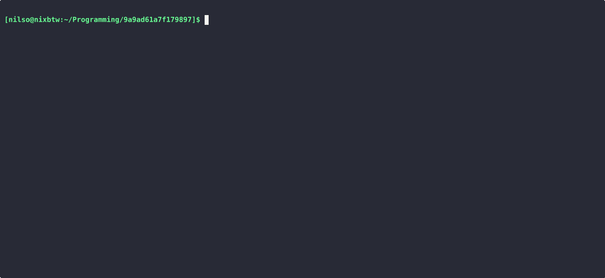

* Simple Shell in Rust
Simple shell in rust following [[https://codecrafters.io/][codecrafters]] challenge.

** Functionality
The shell can run executables and has the following builtins commands available.
- exit
- echo
- type
- pwd
- cd
